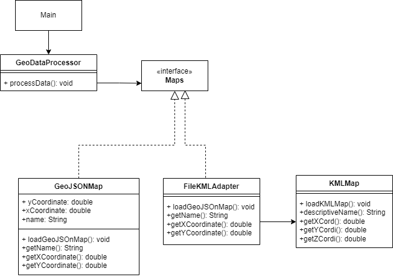

<h1 align="center">Ejercicio 2</h1>
<h2 align="center">Integración de una biblioteca incompatible</h2>
<h3 align="center">Patron de diseño estructural: <b>Adapter</b></h3>
 
<h3>Diagrama de clases:</h3>

En este caso se asumió que la implementación de la biblioteca para mostrar mapas en KML incompatible con el sistema se puede solucionar con el patrón de diseño Adapter, creando una clase adaptadora que implementa la interfaz de mapas y toma los metodos de la clase KMLMap para adaptarlos a los metodos de la inferfaz. Por ejemplo, el formato KML entrega unas coordenadas de 3 paramatros (XYZ), mientras que el formato GEOJSON unicamente trabaja con dos,(XY). El adaptador toma los paramametros "y" y "z" del formato KML y los vuelve uno solo estableciendo siempre "z" como cero, de manera que se pueda adaptar al sistema que unicamente funciona con GeoJSON de dos parametros de coordenadas.  

