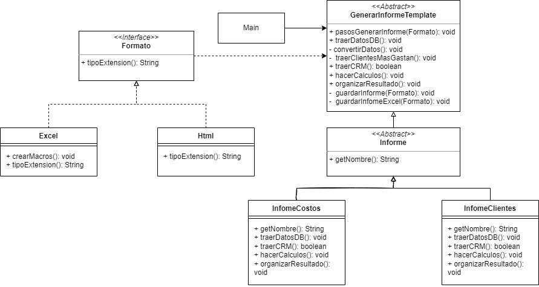

<h1 align="center">Ejercicio 1</h1>
<h2 align="center">Generar informes personalizados</h2>
<h3 align="center">Patron de diseño Comportamental: <b>Template</b></h3>
 
<h3>Diagrama de clases:</h3>

En este caso, se asumió que los formatos, sin importar su tipo, no alterarían ninguno de los pasos del proceso de generar informes, y por ende cualquier acción especifica al formato podría ser manejada por el objeto formato y un if-else en el Template de generador de informes. De igual manera, en caso de necesitarse, se podría usar el patrón Strategy en conjunto para realizar acciones en cada tipo de informe según el tipo de formato de salida

