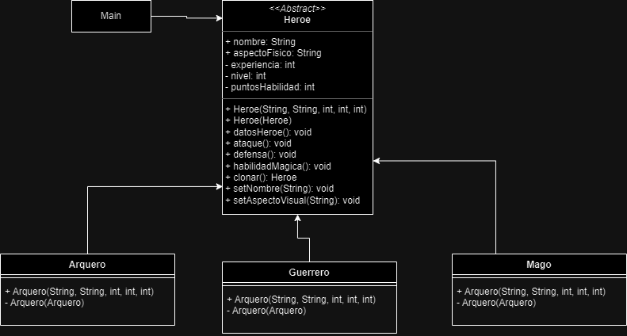

<h1 align="center">Ejercicio 3</h1>
<h2 align="center">Clonación de Personajes en un Video juego de Aventuras</h2>
<h3 align="center">Patron de diseño Creacional: <b>Prototype</b></h3>
 
<h3>Diagrama de clases:</h3>

En este caso, se asumió que que la clonacion de Heroes se puede hacer de forma eficiente con el patron de diseño Creacional Prototype. No se usa una interfaz como el patron de dsieño lo presenta, porque al tener la clase abstracta Heroe, podemos colocar en ella el metodo clonar(), para que las clases que heredan de esta lo sobrescriban.

